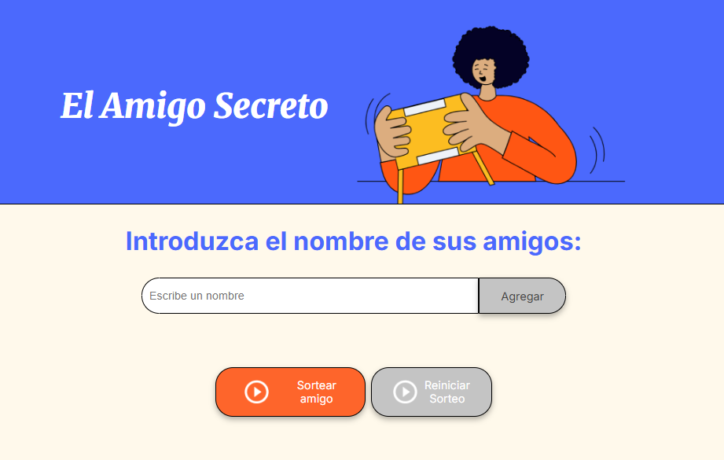
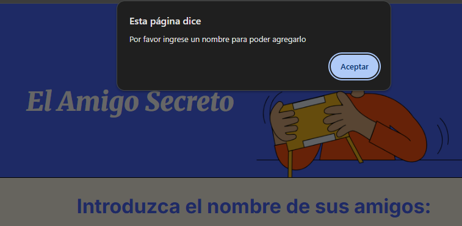
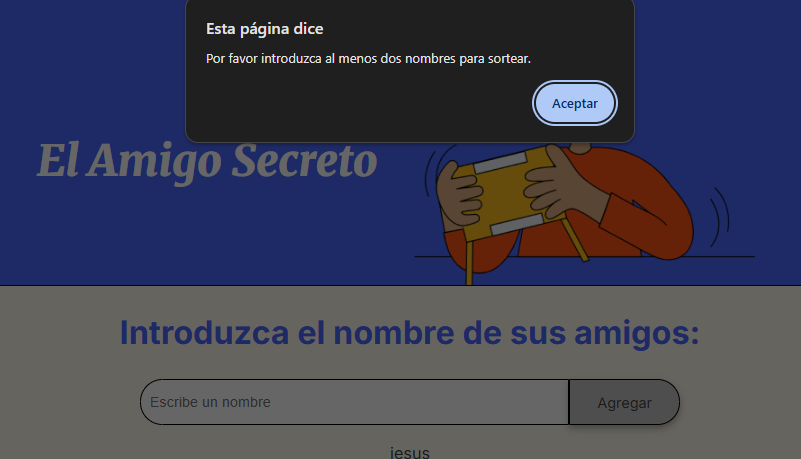
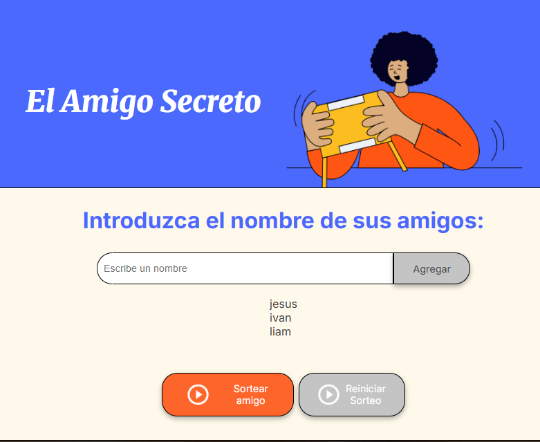
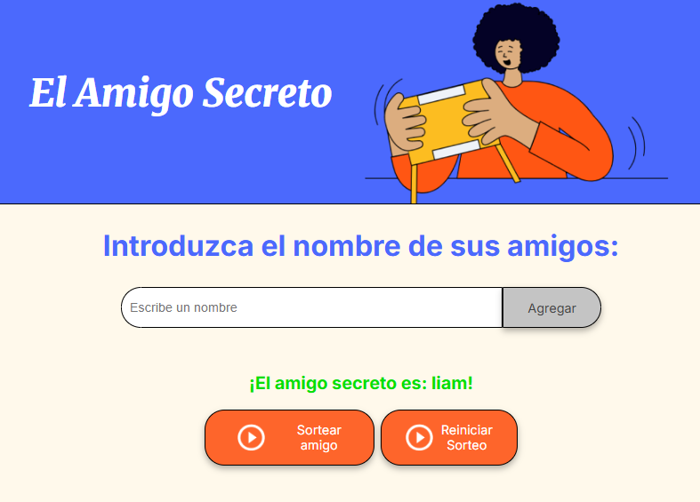
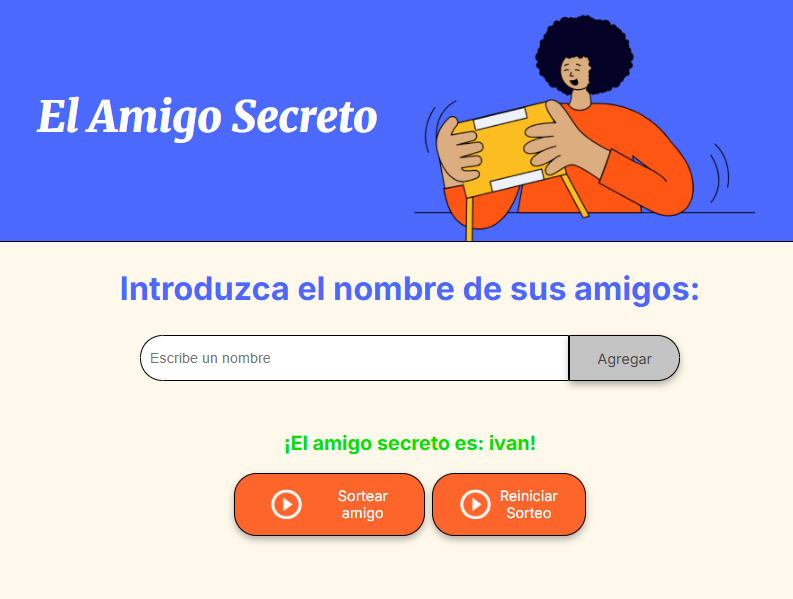

## Challenge Amigo Secreto

## Descripción
Es una aplicacion web interactiva, desarrollada como actividad en un curso de Logica de programacion con JavaScrip en Alura latam.
El cual permite al usuario ingresar una lista de nombres de amigos para posteriormente realizar el sorteo aleatoriamente de alguno de ellos.

## Funcionalidades 
**Agregar nombres:** El usuario puede elegir una serie de nombres que debera escribir en el cuadro de texto y posteriormente dar clic en el botón agregar para que se vayan añadiendo a la lista.

**Visualizar lista de nombres:** Los nombres que vayan siendo ingresados por el usuario podran ser visualizados en forma de lista debajo del cuadro de texto.

**Validar entrada:** Si el campo de texto se encuentra vacio, mostrara un mensaje solicitando ingresar un nombre para poder agregarlo a la lista.
Si se ingresan numeros en el campo de texto, se mostrara un mensaje indicando que solo son validas las letras y los espacios.
Si el usuario desea ingresar un nombre que ya se encuentra en la lista, se mostrara un mensaje indicando que el nombre ya se encuentra en la lista de amigos.

**Validar entrada para sorteo:** Si el usuario no ha ingresado ningun nombre y da ckic en el boton "Sortear amgio" se mostrara un mensaje indicando que no hay nombres en la lista con los cuales realizar el sorteo.
Si el usuario solo ingresa un nombre en la lista y hace clic en el boton "Sortear amigo" el sistema arrojara un mensaje indicando que es necesario ingresar por lo menos 2 nombres para poder realizar el sorteo.

**Sorteo aleatorio:** El usuario debera hacer clic en el boton "sortear amigo", acto seguido el sistema seleccionara de forma aleatoria un nombre de los que previamente ingreso el usuario mostrandolo en la parte inferior de la pantalla y resaltandolo en un color diferente para su facil identificacion.

**Reinicio del sorteo:** Una vez realizado el sorteo y seleccionado un nombre, el sistema habilitara el boton de "Reinicar Sorteo" el cual al dar clic, el sistema limpiara el registro de los nombres ingresados previamente por el usuario, permitiendo al usuario ingresar nuevamente un conjunto de nombre para realizar un nuevo sorteo.

## Capturas de la interfaz del usuario
**Pantalla pcrincipal de la aplicacion:**

**Mensajes de validación:**
CAmpo de texto vacio:

Minimo dos nombres:

Lista de amigos:

**Sorteo de nombre:**

**Habilitación de botón de reincio:**

## Tecnologias utilizadas
**-HTML:** Estructura de la aplicación.
**-CSS:** Estilo y diseño de la aplicacíon.
**-JavaScript:** Desarrollo de logica del proyecto.

## Acceso al proyecto
Para acceder al contenido, puedes clonar o rescargar el repositorio.
Abrir el archivo index.html

## Autor
Desarrollo de HTML y CSS proporcionado por Alura.
Desarrollo de JavaScrip por Jesus Rangel como parte de la actividad del curso Logica de porgramacion impartido por Alura Latam.
